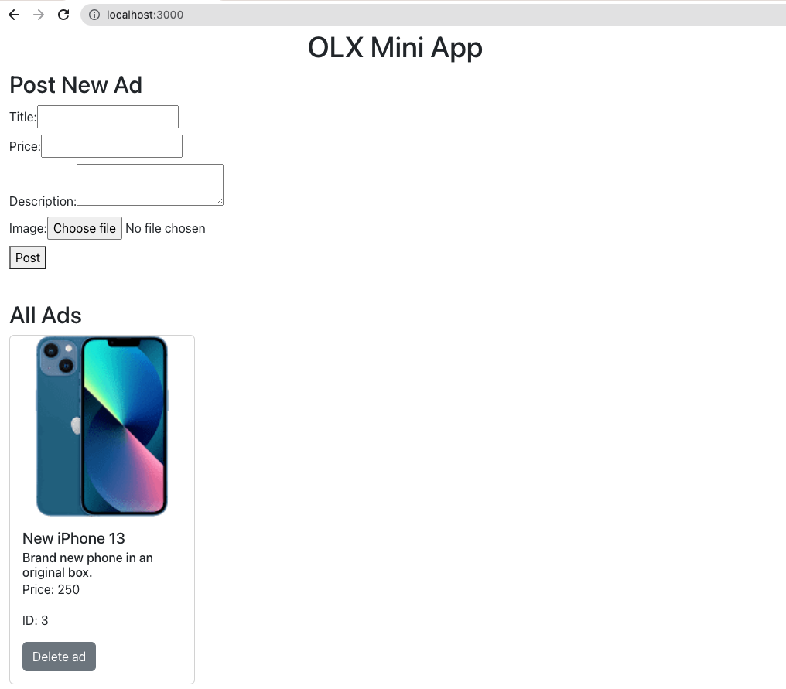

# OLX Frontend Workshop
A project prepared for a frontend workshop in February 2023.

## Requirements

- [Node v18+](https://nodejs.org/en/)
- NPM v6.14+ (Automatically installed with Node).
- [Docker (Desktop for Mac/Windows, Engine for Linux)](https://www.docker.com/get-started).
- Your favorite text editor, we recommend [VS Code](https://code.visualstudio.com) for this workshop but any other would work.
- Internet browser, we recommend Google Chrome which will be used for this workshops but any other would work.

# Development
## Initial setup

Start by quickly setting up a single-page React application using [Create React App](https://reactjs.org/docs/create-a-new-react-app.html#create-react-app).
```sh
npx create-react-app olx-frontend-workshop
```

Go inside the newly created folder:
```sh
cd olx-frontend-workshop
```

At the root of the project, create an `.env` file where permanent variables will be kept. You can learn more about environment variables [here](https://create-react-app.dev/docs/adding-custom-environment-variables/#adding-development-environment-variables-in-env).

We will also need the styling library, so install [styled components](https://styled-components.com/docs/basics) by using:
```sh
npm install --save styled-components
```

Run the app using:
```sh
npm start
```

You should see the app running on [http://localhost:3000/](http://localhost:3000/).


## First steps
### Clean-up

1. Let's clean up the React boilerplate starting with `App.js` file.
```diff
- import logo from './logo.svg';
import './App.css';

function App() {
  return (
    <div className="App">
      <header className="App-header">
+       <h1>OLX Mini App</h1>
-       
-      <p>
-        Edit <code>src/App.js</code> and save to reload.
-       </p>
-       <a
-         className="App-link"
-         href="https://reactjs.org"
-         target="_blank"
-         rel="noopener noreferrer"
-       >
-         Learn React
-      </a>
      </header>
    </div>
  );
}

export default App;
```

2. Now let's clean up the styles we do not need anymore from `App.css`.
```diff
.App {
+  max-width: 1200px;
+  padding: 0 16px 16px 16px;
+  margin: auto;
-  text-align: center;
}

- .App-logo {
-   height: 40vmin;
-   pointer-events: none;
- }
-
- @media (prefers-reduced-motion: no-preference) {
-  .App-logo {
-    animation: App-logo-spin infinite 20s linear;
-  }
- }
-
.App-header {
+  text-align: center;
-  background-color: #282c34;
-  min-height: 100vh;
-  display: flex;
-  flex-direction: column;
-  align-items: center;
-  justify-content: center;
-  font-size: calc(10px + 2vmin);
-  color: white;
}
-
- .App-link {
-  color: #61dafb;
-}
-
- @keyframes App-logo-spin {
-  from {
-    transform: rotate(0deg);
-  }
-  to {
-    transform: rotate(360deg);
-  }
- }
```

3. Remove `logo.svg` file from the `/src` folder.

### CSS into CSS-in-JS transformation

The initial project was created with `.css` files but we will be using `styled-components` library for using CSS-in-JS technique. We will leave `index.css` file as it is but we need to get rid of `App.css` file. 

1. Let's rename `App.js` file into `App.jsx` and insert this code right below the imports:
```diff
import { useState, useEffect } from "react";
import styled from 'styled-components';
- import "./App.css";

+ const App = styled.div`
+   max-width: 1200px;
+   padding: 0 16px 16px 16px;
+   margin: auto;
+ `;

+ const AppHeader = styled.header`
+   text-align: center;
+ `;
```

We are now able to use styled components in this file so our component should look like this:
```diff
  return (
+   <App>
+     <AppHeader>
        <h1>OLX Mini App</h1>
+     </AppHeader>
      <main>
        <PostingForm />
        <hr />
        <Ads ads={ads} onDeleteAd={handleOnDelete} />
      </main>
+   </App>
  );
```

2. Remove `App.css` file.

### Docker configuration

1. Add a configuration file which will be needed later on to reach our API. In order to do that, create a new folder in `/src` scope called `config` and inside it, create an `index.js` file with below content:
```js
const config = {
  api_ads: `${process.env.REACT_APP_API_BASE}/api/ads`,
};

export default config;
```

2. Add configuration which will allow us to run our project using Docker alongside backend. In order to do that, create a file in the root of the project called `Dockerfile` (no extension) with below content:
```docker
FROM node:16.3.0-alpine

WORKDIR /app

# Install app dependencies
# A wildcard is used to ensure both package.json AND
# package-lock.json are copied where available (npm@5+)
COPY package*.json ./

RUN npm install

# Bundle app source
COPY . .

EXPOSE 3000

CMD ["npm", "start"]
```

3. In order to be able to use the `Dockerfile` we need to create one more file in the root of the project called `docker-compose.yml` with below content:
```yml
version: "3.2"
services:
  frontend:
    build:
      context: .
      dockerfile: ./Dockerfile
    ports:
      - 3000:3000
    volumes:
      - ".:/app"
    env_file: .env
    container_name: olx-frontend-workshop

  database:
    image: mysql:5.7.22
    environment:
      MYSQL_ROOT_PASSWORD: ""
      MYSQL_ALLOW_EMPTY_PASSWORD: 1
    container_name: mini-olx-db
    ports:
      - 33061:3306
    volumes:
      - mini-olx-data:/var/lib/mysql

  backend:
    image: aipms/projects:mini-olx-backend
    depends_on:
      - database
    environment:
      WAIT_HOSTS: database:3306
    ports:
      - 4040:4040
    container_name: mini-olx-backend

volumes:
  mini-olx-data:
```

Right now your folder structure should look similar to this:
```diff
  .
+ ├── Dockerfile
+ ├── docker-compose.yml
  ├── README.md
  ├── package-lock.json
  ├── package.json
  ├── public
  │   ├── favicon.ico
  │   ├── index.html
  │   ├── logo192.png
  │   ├── logo512.png
  │   ├── manifest.json
  │   └── robots.txt
  └── src
      ├── App.jsx
      ├── App.test.js
      ├── config
      │   └── index.js
      ├── index.css
      ├── index.js
      ├── reportWebVitals.js
      └── setupTests.js
```

4. Run the project using Docker command.
_Note: If you still have the previous process (from `npm start`) running, kill it first (using `ctr/cmd + c` in the terminal) and only then run below command._
```sh
docker-compose up
```

Once the dependencies load (it will take a moment), our page should look like this:


### Adding Bootstrap

In order to save some time styling the UI later on, we are going to add an external library called [Bootstrap](https://react-bootstrap.github.io/) to our project. This will allow us to use predefined UI components.

1. Install it by running:
```sh
npm install --save react-bootstrap bootstrap
```

2. Add below import to `index.js` file:
```sh
import '../node_modules/bootstrap/dist/css/bootstrap.min.css';
```

## Posting Form
Now, it is time to focus on creating the frontend parts of the application. We will start with the posting form.

1. Let's start by creating a `components` folder inside the `/src` folder where we will store the our components. Then, inside the `/components` folder, create a file called `PostingForm.jsx`.
After those changes, the structure should look like this:
```diff
  .
  ├── Dockerfile
  ├── docker-compose.yml
  ├── README.md
  ├── package-lock.json
  ├── package.json
  ├── public
  │   ├── favicon.ico
  │   ├── index.html
  │   ├── logo192.png
  │   ├── logo512.png
  │   ├── manifest.json
  │   └── robots.txt
  └── src
      ├── App.jsx
      ├── App.test.js
      ├── config
      │   └── index.js
+     └── components
+         └── PostingForm.jsx
      ├── index.css
      ├── index.js
      ├── reportWebVitals.js
      └── setupTests.js
```

2. Time to create our first component :) Add below content to `PostingForm.jsx`:
```jsx
import React, { useRef } from "react";
import styled from 'styled-components';
import config from "../config";

const Label = styled.label`
  display: block;
  margin-top: 8px;
`;

const Button = styled.button`
  margin: 8px 0;
`;

const PostingForm = (props) => {
  const { onPostAd = () => {} } = props;
  const formRef = useRef(null);

  const handleOnSubmit = (e) => {
    e.preventDefault();
    const data = new FormData(e.target);

    fetch(config.api_ads, {
      method: "POST",
      body: data,
    })
      .then((res) => res.json())
      .then(() => {
        onPostAd();
        formRef.current.reset();
      })
      .catch(console.error);
  };

  return (
    <form onSubmit={handleOnSubmit} ref={formRef}>
      <h2>Post New Ad</h2>
      <Label htmlFor="title">
        Title:
        <input id="title" name="title" type="text" required />
      </Label>
      <Label htmlFor="price">
        Price:
        <input id="price" type="number" name="price" step="0.01" required />
      </Label>
      <Label htmlFor="description">
        Description:
        <textarea id="description" name="description" required />
      </Label>
      <Label htmlFor="ad_image">
        Image:
        <input id="ad_image" name="ad_image" type="file" required />
      </Label>
      <Button type="submit">Post</Button>
    </form>
  );
};

export default PostingForm;
```

3. Attach PostingForm to our `App.jsx`
```diff
+ import PostingForm from './components/PostingForm';

const Wrapper = styled.div`
  max-width: 1200px;
  padding: 0 16px 16px 16px;
  margin: auto;
`;

const AppHeader = styled.header`
  text-align: center;
`;

function App() {
  return (
    <Wrapper>
      <Header>
        <h1>OLX Mini App</h1>
      </Header>
+      <main>
+        <PostingForm />
+      </main>
    </Wrapper>
  );
}

export default App;
```

At this point, the application should look like this  :point_down: Try posting some ads!  :sparkler:


## Ad listing
Since we can already ad adverts in our application, let's create a way to present them. 
1. Start by creating `Ads.jsx` file under `/src/components`.

Your project structure should be similar to this:
```diff
  .
  ├── Dockerfile
  ├── docker-compose.yml
  ├── README.md
  ├── package-lock.json
  ├── package.json
  ├── public
  │   ├── favicon.ico
  │   ├── index.html
  │   ├── logo192.png
  │   ├── logo512.png
  │   ├── manifest.json
  │   └── robots.txt
  └── src
      ├── App.css
      ├── App.jsx
      ├── App.test.js
      ├── config
      │   └── index.js
      └── components
+         └── Ads.jsx
          └── PostingForm.jsx
      ├── index.css
      ├── index.js
      ├── reportWebVitals.js
      └── setupTests.js
```

2. Finally, let's focus on creating the ads listing component. Add below code to `Ads.jsx`:
```jsx
import React from "react";
import styled from "styled-components";
import Button from "react-bootstrap/Button";
import Card from "react-bootstrap/Card";

const UnorderedList = styled.ul`
  list-style: none;
  padding: 0;
  margin: 0;
`;

const ListItem = styled.li`
  margin-bottom: 16px;
`;

const Ads = (props) => {
  const { ads = [], onDeleteAd = () => {} } = props;

  return (
    <>
      <h2>All Ads</h2>

      <UnorderedList>
        {ads?.map((ad) => {
          return (
            <ListItem key={ad.id}>
              <Card style={{ width: 240 }}>
                <Card.Img src={ad.ad_image ?? null} />
                <Card.Body>
                  <Card.Title>{ad.title}</Card.Title>
                  <Card.Subtitle>{ad.description}</Card.Subtitle>
                  <Card.Text>Price: {ad.price}</Card.Text>
                  <Card.Text>ID: {ad.id}</Card.Text>
                  <Button variant="secondary" onClick={() => onDeleteAd(ad.id)}>
                    Delete ad
                  </Button>
                </Card.Body>
              </Card>
            </ListItem>
          );
        })}
      </UnorderedList>
    </>
  );
};

export default Ads;
```

3. Now, we have to connect our newly created Ads component to our App. We need to import it in the `App.jsx` file and also create two functions. First one should fetch our ads from the backend and the second one should delete an ad.

```diff
+ import { useState, useEffect } from "react";
import styled from 'styled-components';
import PostingForm from "./components/PostingForm";
+ import Ads from "./components/Ads";
+ import config from "./config";

const Wrapper = styled.div`
  max-width: 1200px;
  padding: 0 16px 16px 16px;
  margin: auto;
`;

const AppHeader = styled.header`
  text-align: center;
`;

function App() {
+  const [ads, setAds] = useState([]);
+
+  const fetchAllAds = () => {
+    fetch(config.api_ads)
+      .then((res) => res.json())
+      .then((response) => setAds(response.data))
+      .catch((err) => console.error(err));
+  };
+
+  const handleOnDelete = (adId) => {
+    if (!adId) {
+      return;
+    }
+    fetch(`${config.api_ads}/${adId}`, { method: "DELETE" })
+      .then((res) => res.json())
+      .then((response) => fetchAllAds())
+      .catch((err) => console.error(err));
+  };

+
+  useEffect(() => {
+    fetchAllAds();
+  }, []);

  return (
    <Wrapper>
      <AppHeader>
        <h1>Mini OLX</h1>
      </AppHeader>
      <main>
        <PostingForm />
+       <hr />
+       <Ads ads={ads} onDeleteAd={handleOnDelete}/>
      </main>
    </Wrapper>
  );
}
```

4. Right now newly created ad appears on the page only after we reload it. Let's fix it by adding `handleOnPostAd()` function which will be called once a new ad is posted. Add the following to the `App.jsx`:

```diff
import { useState, useEffect } from "react";
import styled from "styled-components";
import PostingForm from "./components/PostingForm";
import Ads from "./components/Ads";
import config from "./config";

const Wrapper = styled.div`
  max-width: 1200px;
  padding: 0 16px 16px 16px;
  margin: auto;
`;

const AppHeader = styled.header`
  text-align: center;
`;

function App() {
  const [ads, setAds] = useState([]);

  const fetchAllAds = () => {
    fetch(config.api_ads)
      .then((res) => res.json())
      .then((response) => setAds(response.data))
      .catch((err) => console.error(err));
  };

  const handleOnDelete = (adId) => {
    if (!adId) {
      return;
    }
    fetch(`${config.api_ads}/${adId}`, { method: "DELETE" })
      .then((res) => res.json())
      .then((response) => fetchAllAds())
      .catch((err) => console.error(err));
  };

+ const handleOnPostAd = () => {
+   fetchAllAds();
+ };

  useEffect(() => {
    fetchAllAds();
  }, []);

  return (
    <Wrapper>
      <AppHeader>
        <h1>OLX Mini App</h1>
      </AppHeader>
      <main>
+       <PostingForm onPostAd={handleOnPostAd} />
        <hr />
        <Ads ads={ads} onDeleteAd={handleOnDelete} />
      </main>
    </Wrapper>
  );
}

export default App;
```

Now your page should look like this :point_down:


If you reached this place - congratulations! You have a working single-page application 	:raised_hands:
